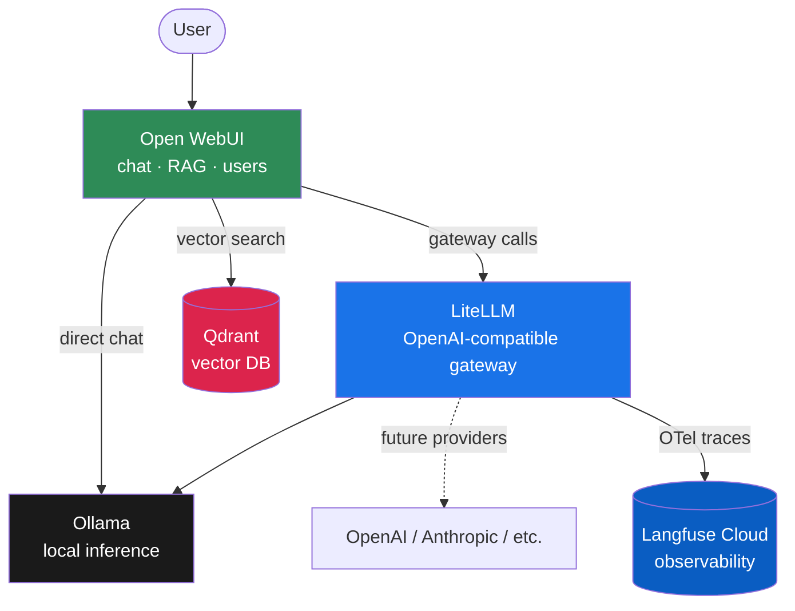

<div align="center">

# 🧠 AI Infra Lab

### Self-Hosted LLM Infrastructure — Built From Scratch, Running on a Laptop

*Ollama &middot; Open WebUI &middot; Qdrant &middot; LiteLLM &middot; Langfuse*

[](https://podman.io)
[](https://ollama.com)
[](https://qdrant.tech)
[](https://litellm.ai)
[](https://langfuse.com)
[](#license)

**A fully self-hosted, locally-run AI platform** — chat UI, model gateway, vector search,
and full request tracing, deployed entirely with containers on a CPU-only machine.
No cloud inference. No API spend. Full visibility into every request.

</div>

---

## 📐 Architecture



Every container runs on a single private network with built-in DNS — services reach each
other by container name (`http://ollama:11434`, `http://qdrant:6333`), never by `localhost`,
which only works for host-to-container traffic.

---

## ⚙️ The Stack

| Layer | Tool | Role |
|---|---|---|
| 🦙 **Inference** | [Ollama](https://ollama.com) | Runs LLMs and embedding models locally, CPU or GPU |
| 💬 **Frontend** | [Open WebUI](https://openwebui.com) | Chat interface, user/permission management, RAG knowledge bases |
| 🧮 **Vector Store** | [Qdrant](https://qdrant.tech) | Stores embeddings, powers RAG retrieval |
| 🔀 **Gateway** | [LiteLLM](https://litellm.ai) | Unified OpenAI-compatible API across any model provider, virtual keys |
| 🔍 **Observability** | [Langfuse](https://langfuse.com) | End-to-end request tracing — tokens, cost, latency, errors |
| 📦 **Runtime** | [Podman](https://podman.io) | Daemonless, rootless containers — no background daemon eating RAM |

---

## 🚀 Quick Start

```bash
git clone <this-repo-url>
cd ai-infra-lab

# 1. Bring up the stack
podman-compose up -d

# 2. Pull models (CPU-friendly sizes)
podman exec -it ollama ollama pull llama3.2:3b
podman exec -it ollama ollama pull nomic-embed-text   # for RAG

# 3. Open the chat UI
# → http://localhost:3000  (first signup becomes admin)
```

Full step-by-step walkthrough — including Windows/PowerShell-specific commands — is in
[`SETUP.md`](./SETUP.md).

### Ports

| Service | URL |
|---|---|
| Open WebUI | http://localhost:3000 |
| LiteLLM Gateway | http://localhost:4000 |
| Ollama API | http://localhost:11434 |
| Qdrant | http://localhost:6333 |

---

## ✨ Highlights

- 🖥️ **Runs entirely on CPU** — no GPU required. Tuned for small, fast models (1B–3B params).
- 🔐 **Daemonless & rootless** via Podman — no persistent background service draining resources.
- 📊 **Full observability out of the box** — every request through LiteLLM is automatically traced
  in Langfuse: model, tokens, cost, latency, errors. Zero manual instrumentation.
- 🗂️ **RAG-ready** — Qdrant + Open WebUI knowledge bases, fully wired for document Q&A.
- 💾 **Host-mounted data** — all persistent state lives in plain folders on disk (`./data/`),
  not buried in opaque container storage. Easy to inspect, back up, or move.
- 🧩 **Provider-agnostic gateway** — LiteLLM means swapping or adding model providers later
  (OpenAI, Anthropic, etc.) never requires touching the frontend.

---

## 📁 Project Structure

```
ai-infra-lab/
├── docker-compose.yml       # full stack definition
├── litellm_config.yaml      # model routing + Langfuse tracing config
├── SETUP.md                 # step-by-step setup walkthrough
└── data/                    # host-mounted persistent storage
    ├── ollama/
    ├── open-webui/
    └── qdrant/
```

## 🔒 Security Notes

- All credentials in this repo's tracked files are **placeholders**. Real keys are
  supplied via local environment overrides and are never committed.
- Rotate any key immediately if it's ever pasted into a chat tool, ticket, or log —
  treat it as compromised regardless of context.
- This setup is built for **local learning use**. Before exposing any service beyond
  `localhost`, put a reverse proxy (e.g. Nginx) in front and replace every default
  secret in `docker-compose.yml` / `litellm_config.yaml`.

---

## 🗺️ Roadmap

- [x] Ollama + Open WebUI + Qdrant + LiteLLM wired together
- [x] Langfuse Cloud tracing via LiteLLM's OTel callback
- [x] Migrated from named volumes to host-mounted storage
- [ ] Open WebUI users/permissions + knowledge-base RAG test pass
- [ ] Qdrant collection backup/restore drill

---

## 📜 License

MIT — see [`LICENSE`](./LICENSE).

<div align="center">

*Built as a hands-on infrastructure learning project — from bare containers to full observability, one debugged YAML file at a time.*

</div>
